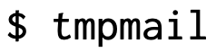

<h1 align="center">
  
</h1>
<p align="center"> A temporary email right from your terminal written in POSIX sh</p><br>

 `tmpmail` is a command line utility written in POSIX `sh` that allows you to create a temporary email address
and receive emails to the temporary email address. It uses 1secmail's [API](https://www.1secmail.com/api/)
to receive emails.

By default `w3m` is used to render the HTML emails on the terminal.
But if you prefer another text based web browser or would rather view the email in a GUI web browser such as Firefox, simply
use the `--browser` argument followed by the command needed to launch the web browser of your choice.

<br>
<br>
<br>

## Dependencies
- `w3m`
- `curl`
- [`jq`](https://github.com/stedolan/jq)

## Installation
### Install locally

```bash
# Download the tmpmail file and make it executable
$ curl -L "https://git.io/tmpmail" > tmpmail && chmod +x tmpmail

# Then move it somewhere in your $PATH. Here is an example:
$ mv tmpmail ~/bin/
```

### AUR
`tmpmail` is available on the [AUR](https://aur.archlinux.org/packages/tmpmail-git/), which is currently being maintained by [Benjamin Bädorf](https://github.com/b12f)

```bash
$ yay -S tmpmail-git
```

### Nixpkgs
`tmpmail` is also available in the [nix package collection (only unstable currently)](https://search.nixos.org/packages?channel=unstable&show=tmpmail&from=0&size=50&sort=relevance&query=tmpmail), which is maintained by [legendofmiracles](https://github.com/legendofmiracles)

Either add it to your system packages, install it with nix-env or try it out in a ephemeral nix-shell `nix-shell -p tmpmail`

### Docker

requirements:
 - [docker](https://www.docker.com/)
 - clone this repo

```bash                                                                                        
$ docker build -t mail .; # Dockerfile available in source code
$ docker run -it mail /bin/bash; 
root@xyz:/# tmpmail; # already inside a docker container
```   

## Usage
```console
$ tmpmail --help
tmpmail
tmpmail -h | --version
tmpmail -g [ADDRESS]
tmpmail [-t | -b BROWSER] -r | ID

When called with no option and no argument, tmpmail lists the messages in
the inbox and their numeric IDs.  When called with one argument, tmpmail
shows the email message with specified ID.

-b, --browser BROWSER
        Specify BROWSER (default: w3m) that is used to render the HTML of
        the email
-g, --generate [ADDRESS]
        Generate a new email address, either the specified ADDRESS, or
        randomly create one
-h, --help
        Show help
-r, --recent
        View the most recent email message
-t, --text
        View the email as raw text, where all the HTML tags are removed.
        Without this option, HTML is used.
--version
        Show version
```

### Examples
Create random email
```console
$ tmpmail --generate
xoithrjagpx@1secmail.net
```

Create custom email
```console
$ tmpmail --generate mycustomemail@1secmail.com
mycustomemail@1secmail.com
```

View the inbox
```console
$ tmpmail
[ Inbox for wdebivbyjor@1secmail.com ]

83414443   username@example.com   Test Email
```

View the email
```console
$ tmpmail 83414443
```

View the most recent email
```console
$ tmpmail -r
```

View emails as pure text
```console
$ tmpmail -t 83414443
To: wdebivbyjor@1secmail.com
From: username@example.com
Subject: Test Email

Hello World

[Attachments]
https://is.gd/aBCdEf [apple.jpg]
https://is.gd/AbCDeF [ball.jpg]
```

## Credits
This script is heavily inspired by Mitch Weaver's [`1secmail`](https://github.com/mitchweaver/bin/blob/master/OLD/1secmail) script
